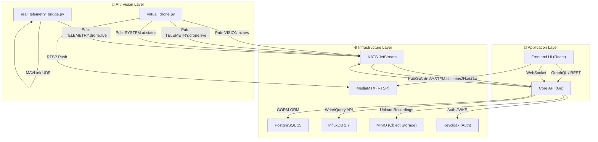
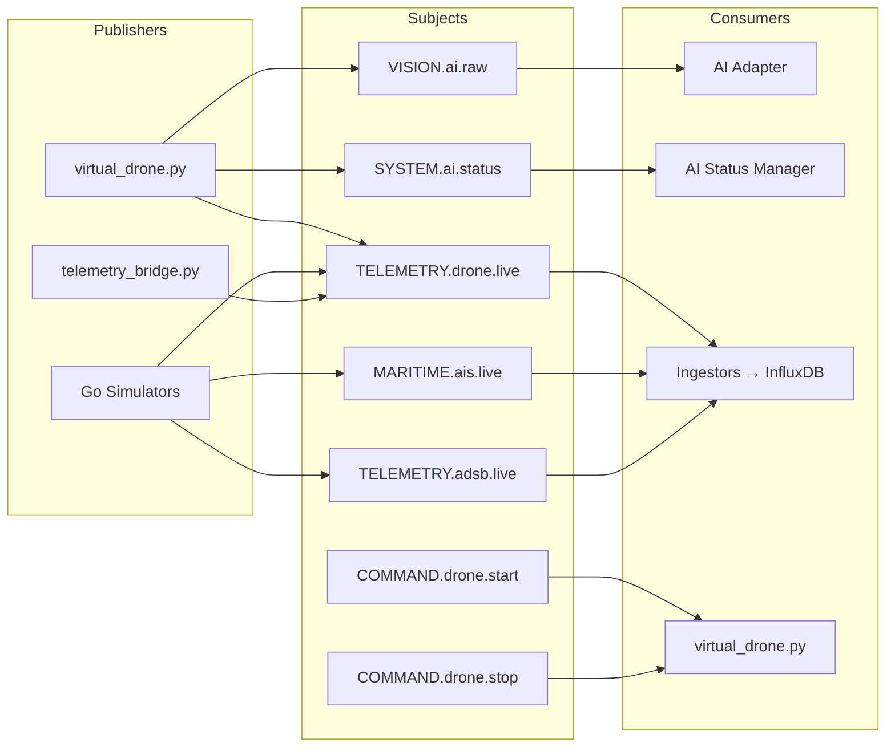
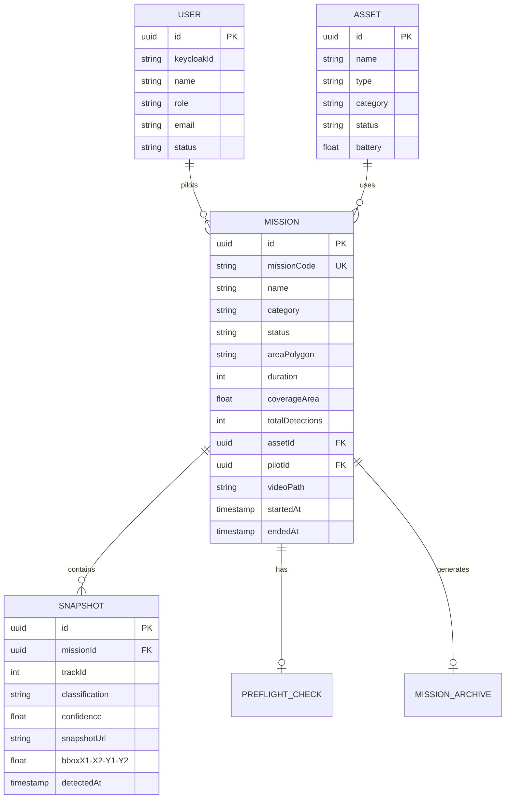
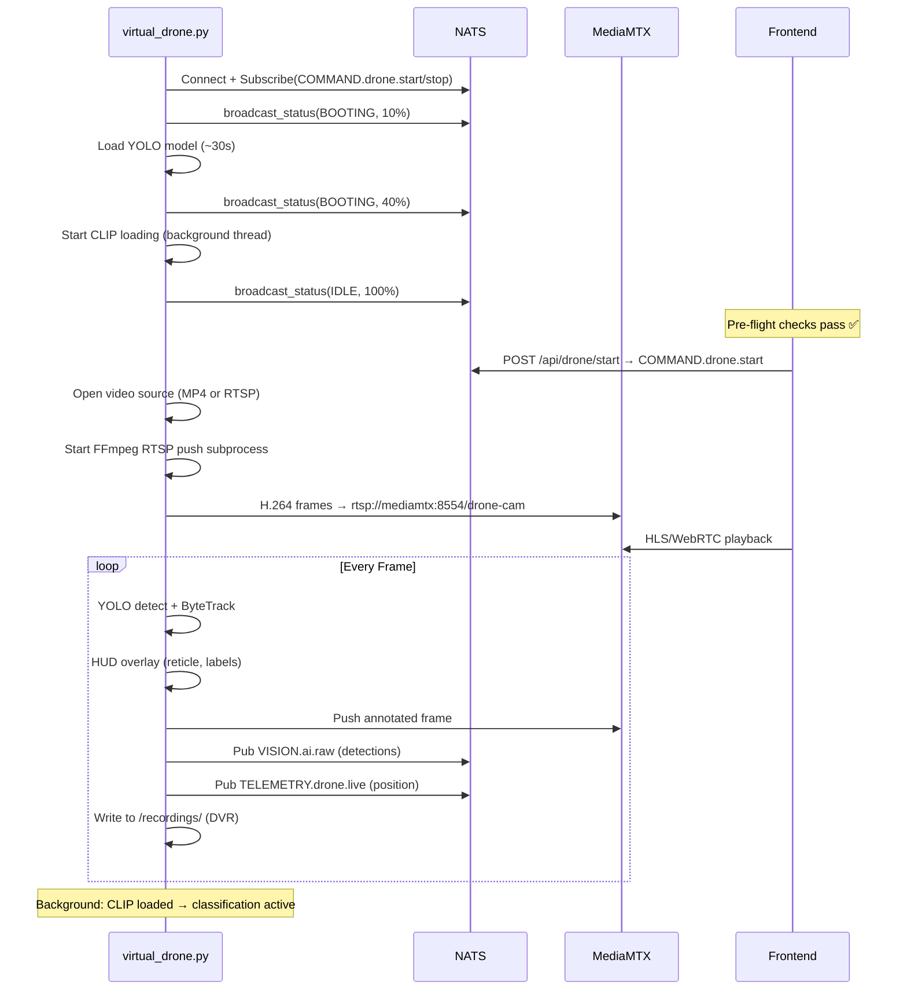
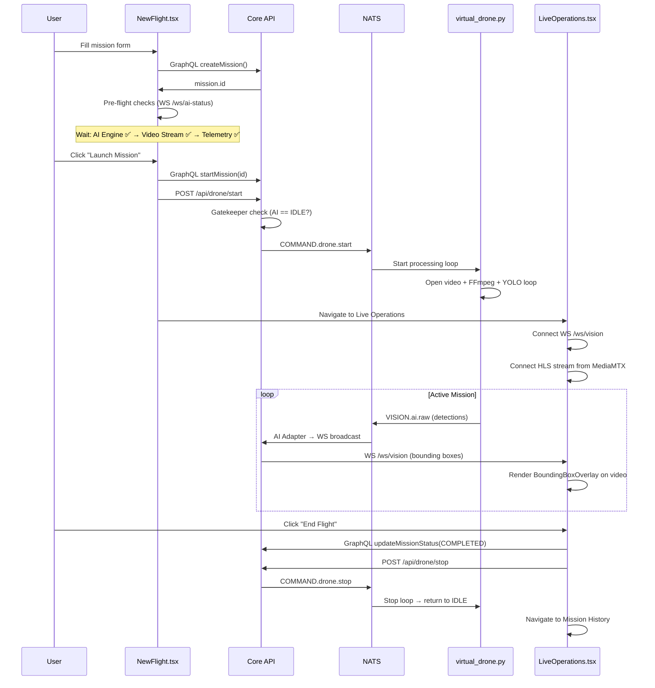
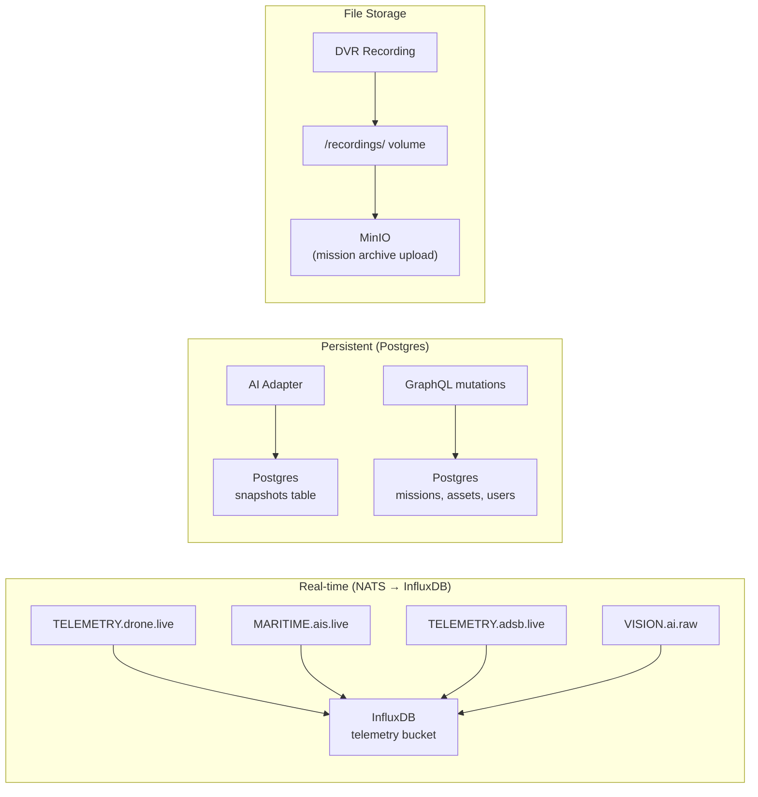

# 🏗️ Mariview Edge — System Architecture

> **Locallitix Mariview Edge** adalah platform drone surveillance maritim terintegrasi.  
> Dokumen ini menjelaskan **seluruh flow** dari infrastruktur, backend, AI pipeline, hingga frontend.

---

## 🗂️ High-Level Architecture



---

## 🐳 Docker Services

| Service | Image | Port | Fungsi |
|---|---|---|---|
| `locallitix-postgres` | `postgres:15-alpine` | 5432 | Database utama (missions, assets, users, snapshots) |
| `locallitix-keycloak` | `keycloak:22.0.5` | 8081 | SSO / OAuth2 authentication |
| `locallitix-influxdb` | `influxdb:2.7-alpine` | 8086 | Time-series (telemetry, detections, AIS) |
| `locallitix-backbone` | `nats:latest` | 4222 | Message bus (JetStream) |
| `locallitix-video` | `mediamtx:latest` | 8554/8888 | RTSP↔HLS/WebRTC media server |
| `locallitix-minio` | `minio/minio` | 9000/9001 | Object storage (recordings) |
| `locallitix-core-api` | Go custom | 8080 | Backend API (GraphQL + REST + WS) |
| `locallitix-ui` | React → nginx | 3000 | Frontend SPA |
| `locallitix-ai-vision` | Python custom | — | AI pipeline (YOLO + CLIP + stream) |
| `locallitix-telemetry-bridge` | Python custom | 14550/udp | MAVLink → NATS bridge *(profile: real)* |

### Docker Volumes

| Volume | Shared Between | Isi |
|---|---|---|
| `pg-data` | postgres | Database Postgres |
| `influx-data` | influxdb | InfluxDB time-series |
| `nats-data` | backbone | NATS JetStream persistence |
| `minio-data` | minio | Object storage data |
| `recordings-data` | ai-vision ↔ core-api | MP4 rekaman misi (DVR) |
| `hf-cache` | ai-vision | HuggingFace model cache (CLIP ~600MB) |

---

## 🔀 NATS Subjects



| Subject | Publisher | Consumer | Payload |
|---|---|---|---|
| `VISION.ai.raw` | virtual_drone.py | AI Adapter → WS → frontend | Frame detections (bbox, class, confidence, snapshot_b64) |
| `SYSTEM.ai.status` | virtual_drone.py | AI Status Manager → WS `/ws/ai-status` | `{state, message, progress, drone_mode}` |
| `TELEMETRY.drone.live` | virtual_drone.py / telemetry_bridge / Go simulator | Drone Ingestor → InfluxDB | `{lat, lon, alt, speed, battery, ...}` |
| `MARITIME.ais.live` | Go AIS Simulator | AIS Ingestor → InfluxDB | AIS vessel positions |
| `TELEMETRY.adsb.live` | Go Flight Simulator | Flight Ingestor → InfluxDB | ADS-B aircraft data |
| `COMMAND.drone.start` | Core API (POST) | virtual_drone.py | `{action: "start"}` |
| `COMMAND.drone.stop` | Core API (POST) | virtual_drone.py | `{action: "stop"}` |

---

## 🔙 Backend — Core API (Go)

### Endpoints

| Type | Endpoint | Auth | Fungsi |
|---|---|---|---|
| REST | `POST /api/auth/login` | ❌ | Keycloak login → set HTTP-only cookie |
| REST | `POST /api/auth/logout` | ❌ | Clear auth cookie |
| REST | `GET /api/auth/me` | 🍪 | Get current user info |
| GraphQL | `POST /api/graphql` | 🍪 | All CRUD operations |
| REST | `POST /api/drone/start` | 🍪 | Publish `COMMAND.drone.start` (Gatekeeper: AI must be IDLE) |
| REST | `POST /api/drone/stop` | 🍪 | Publish `COMMAND.drone.stop` |
| REST | `/api/admin/users` | 🍪+COMMANDER | User management (CRUD) |
| WebSocket | `/ws/vision` | ❌ | Real-time YOLO detections (bounding boxes) |
| WebSocket | `/ws/ai-status` | ❌ | AI engine lifecycle (BOOTING/IDLE/ACTIVE) |

### GraphQL Schema

**Queries:**
- `getMissions(status)` — list missions with snapshots
- `getMissionById(id)` — single mission detail
- `getAssets(category)` — drone/AUV assets
- `getMissionTelemetry(missionId)` — InfluxDB time-series
- `getMissionDetections(missionId)` — InfluxDB AI detections
- `getAISVessels` — InfluxDB AIS vessel positions
- `getLiveDrones` — InfluxDB live drone telemetry
- `getLiveFlights` — InfluxDB ADS-B flights

**Mutations:**
- `createMission(input)` → create new mission
- `updateMissionStatus(id, status)` → PENDING/LIVE/COMPLETED/ABORTED
- `startMission(id)` → set status=LIVE, set startedAt
- `abortMission(id)` → set status=ABORTED
- `deleteMission(id)` / `deleteAllMissions`
- `submitPreFlightCheck(input)` → save pre-flight checklist

### Domain Models



### AI Adapter Flow

```
VISION.ai.raw (NATS JetStream)
  │
  ├──→ WebSocket broadcast channel → /ws/vision → Frontend (live bounding boxes)
  │
  ├──→ InfluxDB write (ai_detections measurement)
  │
  └──→ Postgres Snapshot INSERT (throttled: 1 per class per 5 seconds)
        │
        └── Resolves active LIVE mission (polled every 5s from Postgres)
            └── snapshot.snapshotUrl = "data:image/jpeg;base64,..." (base64 crop)
```

---

## 🤖 AI Vision Pipeline — virtual_drone.py

### Startup Sequence



### Dual Mode

| Feature | `DRONE_MODE=virtual` | `DRONE_MODE=real` |
|---|---|---|
| **Video Source** | `drone.mp4` (looping) | Live RTSP from drone camera |
| **Telemetry** | Simulated (TelemetryState) | MAVLink UDP → [real_telemetry_bridge.py](file:///mnt/c/Work/Project/locallitix-mariview-edge/workers/vision/real_telemetry_bridge.py) |
| **DVR Recording** | Slice MP4 by flight duration | Raw drone stream (without bounding boxes) |
| **Startup** | Same YOLO/CLIP pipeline | Same YOLO/CLIP pipeline |

### Per-Frame Pipeline

```
cv2.VideoCapture → frame
       │
       ▼
  YOLO v8n detect (conf=0.35)
       │
       ▼
  ByteTracker (object tracking)
       │
       ├──→ New track_id? → Queue for CLIP classification (async)
       │
       ▼
  HUD Overlay (military reticle + labels + telemetry bar)
       │
       ├──→ FFmpeg stdin → RTSP push (MediaMTX) → Frontend stream
       │
       ├──→ cv2.VideoWriter → /recordings/annotated_*.mp4
       │
       └──→ NATS publish VISION.ai.raw {detections + snapshot_b64}
```

### CLIP Zero-Shot Classification

- Loaded **asynchronously** in background `ThreadPoolExecutor`
- `clip_state` dict shared between main loop and background thread
- Before CLIP ready: fallback to YOLO class name ("boat", "person")
- After CLIP ready: rich labels ("a military patrol boat", "a cargo ship")
- Cached per `track_id` — only runs once per new object
- Model cache persisted via `hf-cache` Docker volume

---

## 🖥️ Frontend — React SPA

### Navigation / Views

| Section | Component | Fungsi |
|---|---|---|
| Dashboard | [Dashboard.tsx](file:///mnt/c/Work/Project/locallitix-mariview-edge/mariview-frontend/src/components/Dashboard.tsx) | Overview metrics, charts, live status |
| Mission | [NewFlight.tsx](file:///mnt/c/Work/Project/locallitix-mariview-edge/mariview-frontend/src/components/NewFlight.tsx) | Create mission, pre-flight checks, launch |
| Live Operations | [LiveOperationsNew.tsx](file:///mnt/c/Work/Project/locallitix-mariview-edge/mariview-frontend/src/components/LiveOperationsNew.tsx) | Real-time stream + bounding boxes + telemetry |
| Asset Management | [AssetManagement.tsx](file:///mnt/c/Work/Project/locallitix-mariview-edge/mariview-frontend/src/components/AssetManagement.tsx) | Drone fleet management |
| Mission History | [MissionHistory.tsx](file:///mnt/c/Work/Project/locallitix-mariview-edge/mariview-frontend/src/components/MissionHistory.tsx) | Past missions, snapshots, replay, analysis |
| Settings | [SettingsView.tsx](file:///mnt/c/Work/Project/locallitix-mariview-edge/mariview-frontend/src/components/SettingsView.tsx) | System configuration |
| Activity Log | [ActivityLog.tsx](file:///mnt/c/Work/Project/locallitix-mariview-edge/mariview-frontend/src/components/ActivityLog.tsx) | Audit trail |
| Weather | [WeatherForecasting.tsx](file:///mnt/c/Work/Project/locallitix-mariview-edge/mariview-frontend/src/components/WeatherForecasting.tsx) | Maritime weather data |
| ADS-B Stream | [AdsbStream.tsx](file:///mnt/c/Work/Project/locallitix-mariview-edge/mariview-frontend/src/components/AdsbStream.tsx) | Aircraft tracking (Deck.gl map) |
| AIS Stream | [AisStream.tsx](file:///mnt/c/Work/Project/locallitix-mariview-edge/mariview-frontend/src/components/AisStream.tsx) | Vessel tracking (Deck.gl map) |

### Mission Launch Flow



### WebSocket Data Flows

| Endpoint | Direction | Data | Consumer |
|---|---|---|---|
| `/ws/vision` | Server → Client | YOLO detections (bbox, class, confidence) per frame | [LiveOperationsNew.tsx](file:///mnt/c/Work/Project/locallitix-mariview-edge/mariview-frontend/src/components/LiveOperationsNew.tsx) → [BoundingBoxOverlay.tsx](file:///mnt/c/Work/Project/locallitix-mariview-edge/mariview-frontend/src/components/BoundingBoxOverlay.tsx) |
| `/ws/ai-status` | Server → Client | `{state, message, progress, drone_mode}` | [NewFlight.tsx](file:///mnt/c/Work/Project/locallitix-mariview-edge/mariview-frontend/src/components/NewFlight.tsx) (pre-flight checks) |

---

## 📦 Environment Configuration

| Variable | Values | Description |
|---|---|---|
| `DRONE_MODE` | `virtual` / `real` | Master switch for drone operation mode |
| `REAL_DRONE_RTSP_URL` | RTSP URL | Live camera stream (real mode) |
| `MAVLINK_URL` | `udpin:0.0.0.0:14550` | MAVLink UDP endpoint (real mode) |
| `DISABLE_DRONE_SIM` | `true` / `false` | Disable Go drone telemetry simulator |
| `DATALASTIC_API_KEY` | API key | AIS vessel data enrichment |
| `ADSB_API_KEY` | API key | Aircraft tracking data |
| `HF_TOKEN` | HuggingFace token | Suppress rate-limit warnings |
| `YOLO_MODEL` | `yolov8n.pt` | YOLO model variant |
| `YOLO_CONF` | `0.35` | Detection confidence threshold |

---

## 🔄 Data Persistence Flows



---

## 🚀 Deployment Commands

```bash
# Full stack — virtual mode (default)
docker compose up -d --build

# Full stack — real drone mode
DRONE_MODE=real docker compose --profile real up -d --build

# Rebuild specific service only (with cache):
docker compose build locallitix-ui && docker compose up -d locallitix-ui

# Force rebuild without cache:
docker compose build --no-cache locallitix-ui && docker compose up -d locallitix-ui

# View AI vision logs:
docker compose logs -f locallitix-ai-vision

# View core API logs:
docker compose logs -f locallitix-core-api
```
